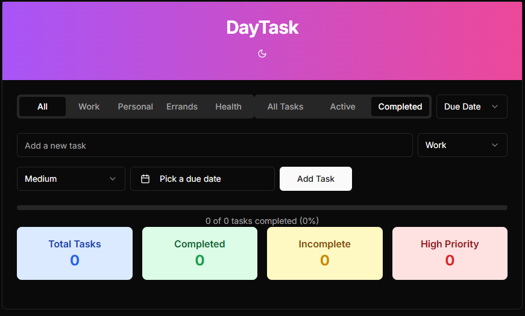
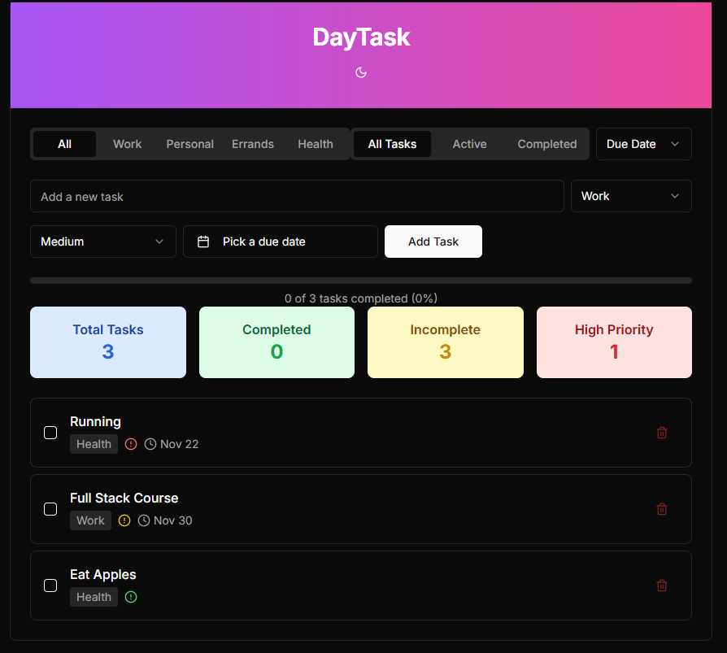
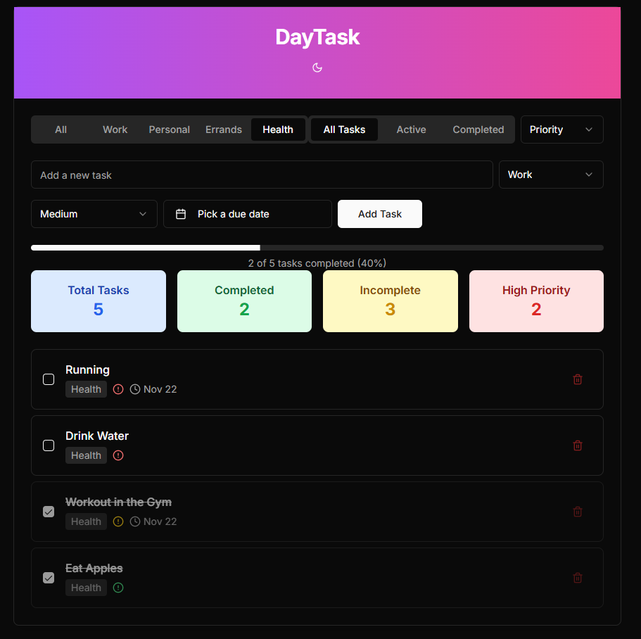

# Task Managment Project(Simple)

## Images of the Task-Managment-App
### TaskManagment App

### After adding Tasks

### Completed and Sorted Tasks by filter/priotriry



## Getting Started

First, run the development server:

```bash
npm run dev
# or
yarn dev
# or
pnpm dev
# or
bun dev
```

Open [http://localhost:3000](http://localhost:3000) with your browser to see the result.


